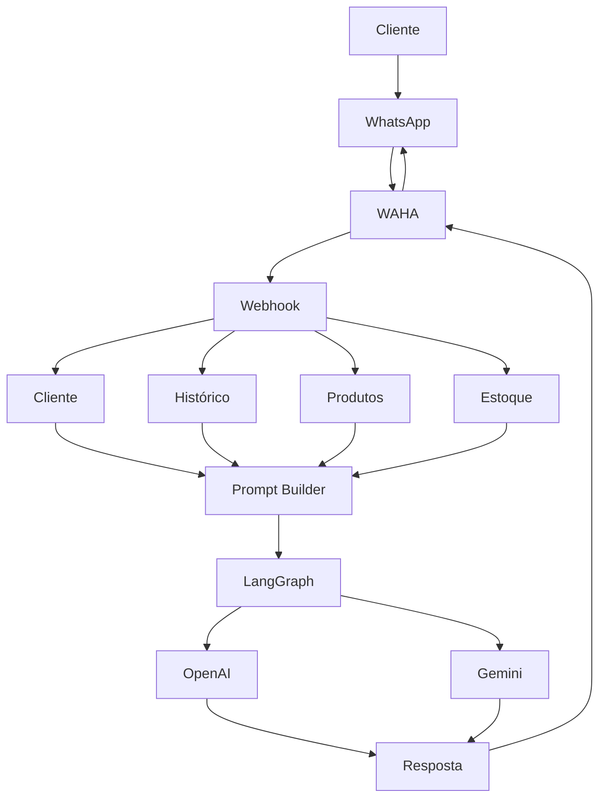

<div align="center">

# 🤖 Chatbot WhatsApp AI

### Assistente de vendas inteligente para WhatsApp utilizando IA Generativa, LangGraph e NestJS

<p align="center">
  
  
  
  
  
  
  
</p>

Automatize vendas e atendimento via WhatsApp utilizando agentes inteligentes capazes de compreender contexto, consultar estoque, registrar pedidos e responder clientes de forma natural.

</div>

---

# ✨ Funcionalidades

- 🤖 Atendimento automático com IA
- 📱 Integração com WhatsApp via WAHA
- 🧠 Memória de conversa
- 👤 Cadastro automático de clientes
- 📦 Consulta de estoque em tempo real
- 🛒 Criação e gerenciamento de pedidos
- 💬 Histórico completo de mensagens
- 🔄 Webhook para eventos do WhatsApp
- 🏪 Regras de negócio customizadas
- 📊 Persistência com TypeORM

---

# 🏗️ Arquitetura



---

# 🎯 Casos de Uso

### Atendimento Comercial

- Apresentação de produtos
- Consulta de disponibilidade
- Esclarecimento de dúvidas
- Registro de interesse

### Gestão de Pedidos

- Criação de pedidos
- Consulta de pedidos
- Atualização de status

### Catálogo Inteligente

- Busca de produtos
- Consulta de estoque
- Recomendações personalizadas

---

# 🧠 Como a IA Funciona

O agente recebe:

- Dados do cliente
- Histórico da conversa
- Produtos cadastrados
- Estoque disponível
- Regras do negócio

Essas informações são transformadas em um contexto estruturado para o modelo de linguagem, permitindo respostas mais precisas e consistentes.

---

# 📂 Estrutura do Projeto

```text
src
│
├── customer
├── messages
├── product
├── stock
├── order
│
├── prompt
│
├── waha
│
├── work-graph
│   ├── graphs
│   ├── tools
│   └── agents
│
├── config
└── database
```

---

# 🚀 Quick Start

## Clonar o projeto

```bash
git clone https://github.com/ruan-rolim-310/chatbot-whatsapp.git

cd chatbot-whatsapp
```

## Instalar dependências

```bash
npm install
```

## Configurar ambiente

```env
OPENAI_API_KEY=
GOOGLE_API_KEY=

WAHA_URL=http://localhost:4000
WAHA_API_KEY=
```

## Rodar aplicação

```bash
npm run start:dev
```

---

# 🐳 Docker

Subir todos os serviços:

```bash
docker compose up -d
```

Serviços incluídos:

- PostgreSQL
- Redis
- WAHA
- n8n
- Chatbot

---

# 📡 Endpoints

## Webhook

```http
POST /waha/webhook
```

Recebe mensagens enviadas pelo WhatsApp.

## Health Check

```http
GET /waha/health
```

---

# 🛠️ Stack Tecnológica

## Backend

- NestJS
- TypeScript
- TypeORM

## Inteligência Artificial

- LangChain
- LangGraph
- OpenAI
- Google Gemini

## Integrações

- WAHA
- WhatsApp

## Infraestrutura

- Docker
- PostgreSQL
- Redis

---

# 📈 Roadmap

- [x] Integração WhatsApp
- [x] Atendimento por IA
- [x] Gestão de estoque
- [x] Gestão de pedidos
- [ ] Painel administrativo
- [ ] Dashboard analítico
- [ ] Multiempresa
- [ ] Integração ERP
- [ ] Integração PIX

---

# 👨‍💻 Autor

**Ruan Rolim**

GitHub:
https://github.com/ruan-rolim-310

---

# 📄 Licença

Este projeto está sob a licença definida pelo repositório.
